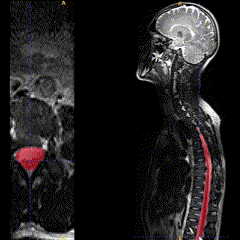

# model-canal-seg

Contrast-agnostic spinal canal segmentation model trained with the [nnUNetv2](https://github.com/MIC-DKFZ/nnUNet) framework. The model segments the spinal canal (dural sac) and outputs a binary segmentation mask. It was designed to work across MRI contrasts and varying resolutions, fields of view, and pathologies.

<p align="center">
  
</p>


## Table of Contents

- [Dependencies](#dependencies)
- [Inference](#inference)
  - [Install the model](#install-the-model)
  - [Run prediction](#run-prediction)
- [Training](#training)
  - [Environment setup](#environment-setup)
  - [Download datasets](#download-datasets)
  - [Prepare datasets](#prepare-datasets)
  - [Train](#train)

---

## Dependencies

- [Spinal Cord Toolbox (SCT)](https://spinalcordtoolbox.com/) — used for reorientation and resampling
- [nnUNetv2](https://github.com/MIC-DKFZ/nnUNet) — used for training and inference
- Python ≥ 3.9, with [PyTorch](https://pytorch.org/) installed
- `jq` — used for JSON parsing in dataset scripts

---

## Inference

### Install the model

Pre-trained model weights are distributed as `.zip` files attached to the [GitHub Releases](https://github.com/ivadomed/model-canal-seg/releases). Download the release zip corresponding to the fold you want to use, then install it into your nnUNet results directory:

```bash
# Set your data directory
export CANALSEG_DATA=/path/to/data

export nnUNet_results="$CANALSEG_DATA/nnUNet/results"
mkdir -p "$nnUNet_results"

# Install the model
nnUNetv2_install_pretrained_model_from_zip /path/to/Dataset101_CanalSeg__nnUNetTrainerDAExtGPU__nnUNetPlans__3d_fullres__fold_0.zip
```

### Run prediction

Use the provided `predict.sh` script to run inference on a single image. The script handles all preprocessing (reorientation to RAS, resampling to 1×1×1 mm) and postprocessing (resampling and reorienting the prediction back to native space) automatically.

```bash
bash predict.sh <INPUT_IMAGE> [OUTPUT_LABEL] [FOLD]
```

**Arguments:**

| Argument | Description | Default |
|---|---|---|
| `INPUT_IMAGE` | Path to input NIfTI image (`.nii.gz`) | *(required)* |
| `OUTPUT_LABEL` | Path for the output segmentation mask | `<input_basename>_label-canal_seg.nii.gz` |
| `FOLD` | nnUNet fold to use for inference | `0` |

**Example:**

```bash
bash predict.sh sub-001_T2w.nii.gz sub-001_label-canal_seg.nii.gz 0
```

**Optional environment variable overrides:**

| Variable | Description | Default |
|---|---|---|
| `CANALSEG` | Path to this repository | `model-canal-seg` |
| `CANALSEG_DATA` | Path to the data directory | `data` |
| `CANALSEG_DEVICE` | Compute device (`cuda` or `cpu`) | auto-detected |
| `CANALSEG_JOBS` | Number of parallel jobs | number of CPU cores |
| `CANALSEG_DATASET` | nnUNet dataset ID | `101` |
| `CANALSEG_TRAINER` | nnUNet trainer class | `nnUNetTrainerDAExtGPU` |
| `CANALSEG_PLANNER` | nnUNet planner class | `nnUNetPlannerResEncL` |
| `CANALSEG_PLANS` | nnUNet plans name | `nnUNetPlans` |

---

## Training

Follow these steps to reproduce the training from scratch.

### Environment setup

Clone this repository and install the required dependencies:

```bash
git clone https://github.com/ivadomed/model-canal-seg.git
cd model-canal-seg
pip install -r requirements.txt
```

Set the environment variables pointing to the repository and data directory (you can also add these to your shell profile):

```bash
export CANALSEG="$(realpath model-canal-seg)"
export CANALSEG_DATA=/path/to/data
```

### Download datasets

The training data is fetched from several BIDS-formatted datasets hosted on Git Annex. Run the download script to clone the repositories, check out the pinned commits, and pull the required image files:

```bash
bash scripts/download_datasets.sh
```

This will:
1. Clone the four source datasets into `$CANALSEG_DATA/bids/`
2. Check out the exact commits used for training
3. Generate `canal.json` (the data configuration file) if it does not already exist
4. Pull the required images and labels via `git annex get`

> **Note:** Access to `data.neuro.polymtl.ca` datasets requires SSH key authorization. Make sure your key is registered before running the script.

### Prepare datasets

Convert the downloaded BIDS data into the nnUNet raw dataset format, reorient to RAS, and resample to 1×1×1 mm isotropic resolution:

```bash
bash scripts/prepare_datasets.sh
```

This will populate `$CANALSEG_DATA/nnUNet/raw/Dataset101_CanalSeg/` with the following structure:

```
Dataset101_CanalSeg/
├── imagesTr/        # Training images  (*_0000.nii.gz)
├── labelsTr/        # Training labels
├── imagesTs/        # Test images      (*_0000.nii.gz)
├── labelsTs/        # Test labels
└── dataset.json     # nnUNet dataset descriptor
```

### Train

Run the training script for a given dataset ID and fold:

```bash
bash scripts/train.sh [DATASET] [FOLD]
```

**Arguments:**

| Argument | Description | Default |
|---|---|---|
| `DATASET` | nnUNet dataset ID | `101` |
| `FOLD` | Cross-validation fold | `0` |

**Example — train on dataset 101, fold 0:**

```bash
bash scripts/train.sh 101 0
```

The script will automatically:
1. Extract the dataset fingerprint
2. Plan the experiment
3. Preprocess the data
4. Train the model
5. Export the trained model to a `.zip` file in `$CANALSEG_DATA/nnUNet/exports/`
6. Run prediction on the test set and save a `summary.json` with evaluation metrics

**Optional environment variable overrides:**

| Variable | Description | Default |
|---|---|---|
| `CANALSEG_DEVICE` | Compute device (`cuda` or `cpu`) | auto-detected |
| `CANALSEG_JOBS` | Number of parallel jobs | number of CPU cores |
| `CANALSEG_JOBSNN` | Number of nnUNet-specific jobs | capped by available RAM |

> **Tip:** On a SLURM cluster, `SLURM_JOB_CPUS_PER_NODE` is automatically detected and used to set the number of parallel jobs.